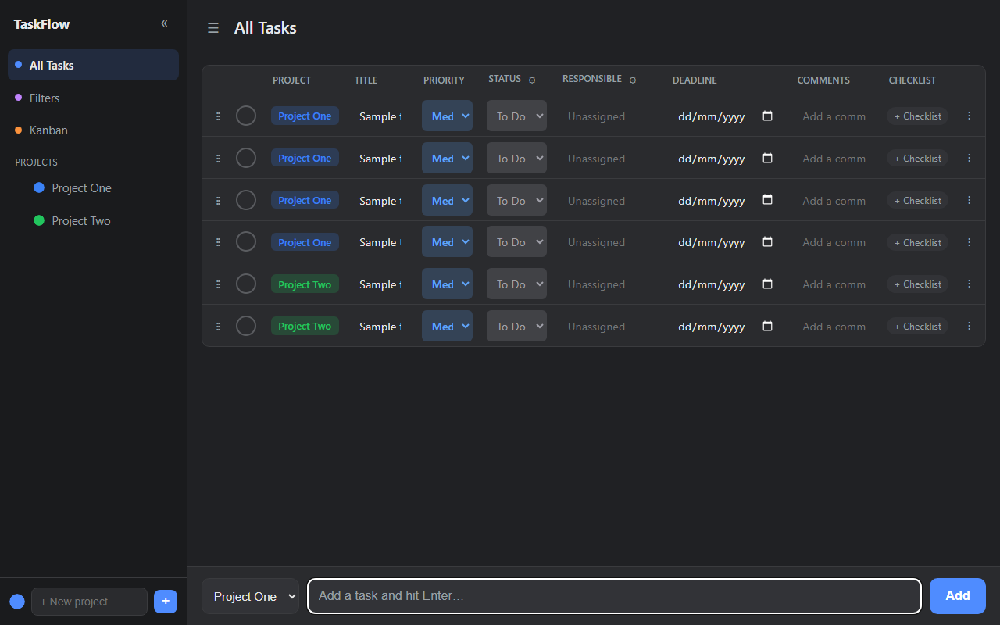
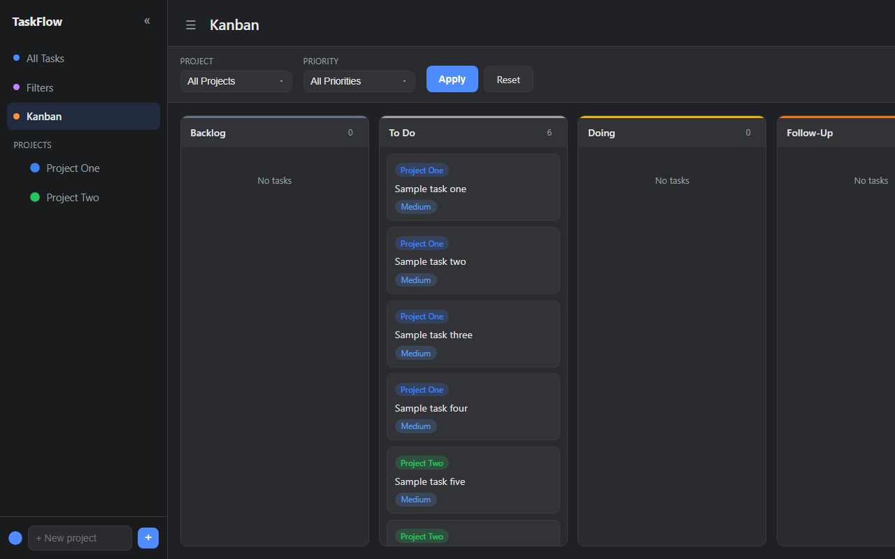
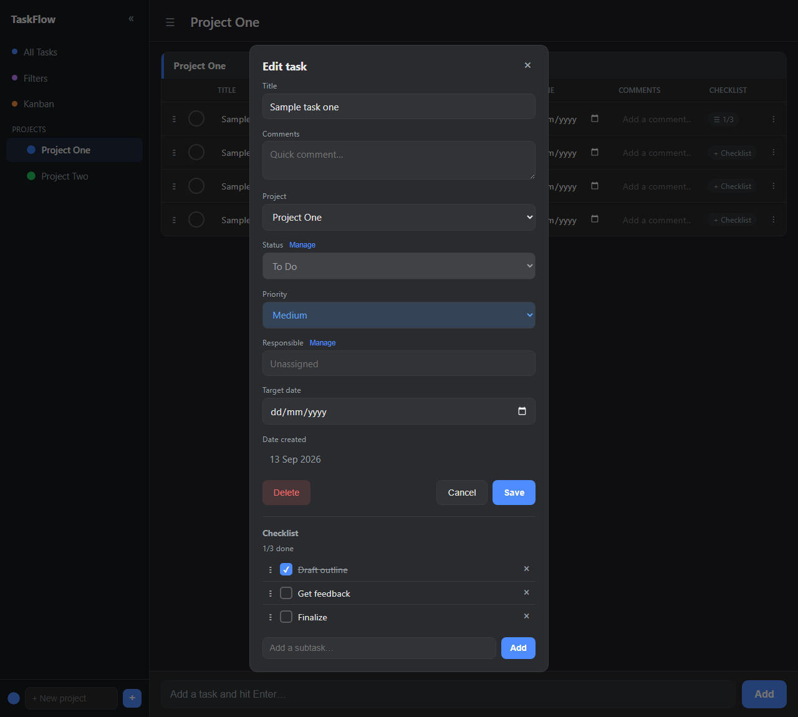
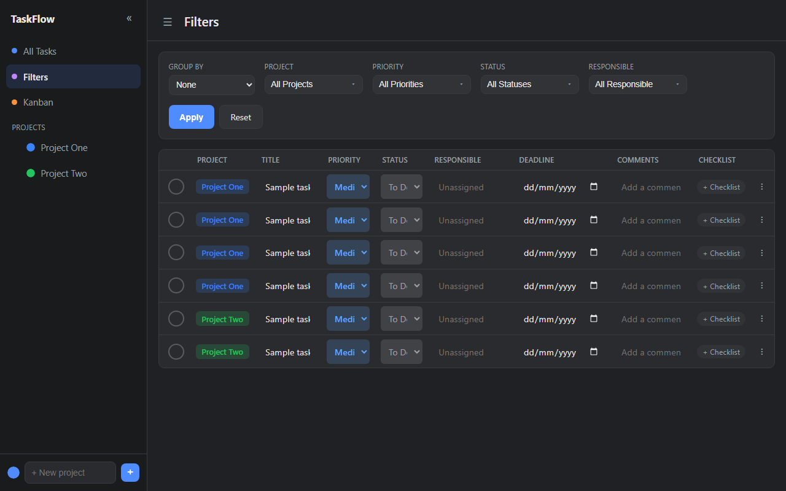
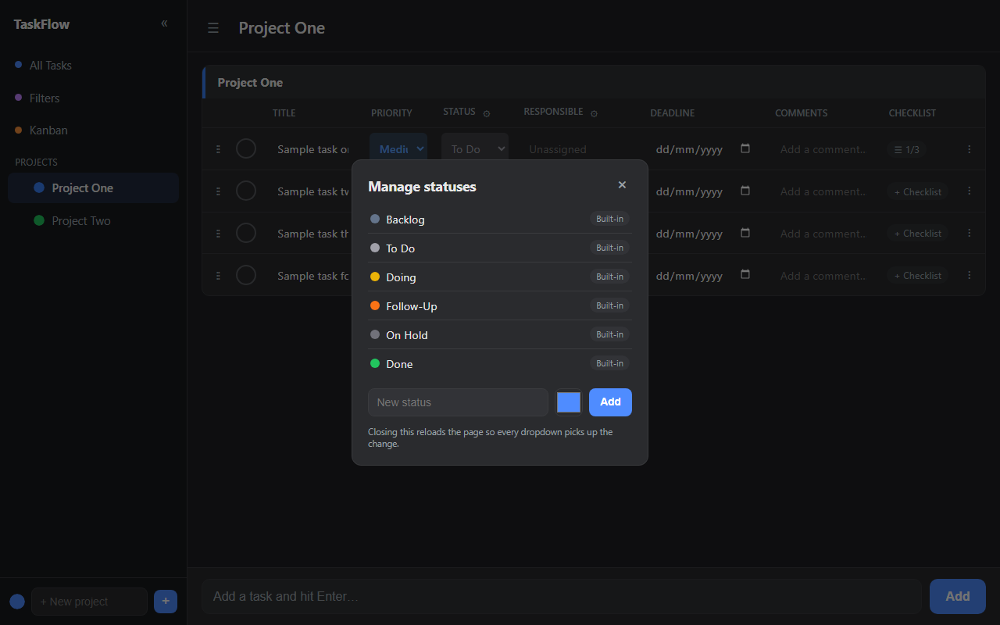
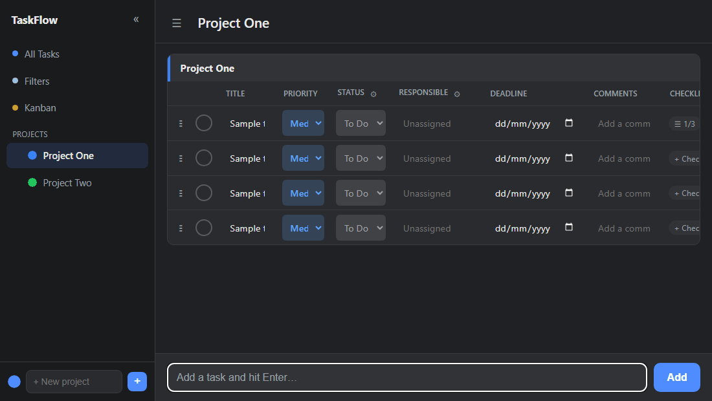

# TaskFlow

A self-hosted task and project management app built with FastAPI, SQLAlchemy, and Jinja2. Organize work into projects, track tasks through custom statuses, manage checklists, and view everything as a list, kanban board, or filtered report.



## Features

- **Projects** — color-coded, drag-to-reorder, grouped sidebar navigation
- **Kanban board** — drag tasks between statuses, filter by project or priority
- **Task details** — comments, priority, responsible, target date, and creation date, all editable inline or in a single-column popup
- **Checklists** — per-task subtasks with drag-to-reorder and live progress tracking, shown directly in the task popup alongside its activity
- **Custom statuses & responsibles** — manage your own workflow stages and team members
- **Filters / reports view** — group and filter tasks across projects

### Kanban board



### Task detail with checklist

The task popup lays out every field one per line and includes its checklist inline, so you can see and update subtasks without leaving the task. It also shows a read-only creation date alongside the editable target date.



### Filters / reports



### Custom statuses



### Checklists in action

Adding and checking off subtasks updates the popup and the task list live.



## Getting started

```bash
git clone <this-repo-url>
cd taskflow
python -m venv venv
venv\Scripts\activate      # Windows
# source venv/bin/activate  # macOS/Linux
pip install -r requirements.txt
copy .env.example .env      # Windows
# cp .env.example .env      # macOS/Linux
uvicorn app.main:app --reload
```

Then open [http://localhost:8000](http://localhost:8000).

## Tech stack

- [FastAPI](https://fastapi.tiangolo.com/) — web framework
- [SQLAlchemy](https://www.sqlalchemy.org/) — ORM
- [Jinja2](https://jinja.palletsprojects.com/) — server-rendered templates
- SQLite — default database (configurable via `DATABASE_URL` in `.env`)

## Configuration

Copy `.env.example` to `.env` and adjust as needed:

| Variable       | Default                       | Description                     |
|----------------|--------------------------------|----------------------------------|
| `DATABASE_URL` | `sqlite:///./taskflow.db`     | SQLAlchemy database connection string |
